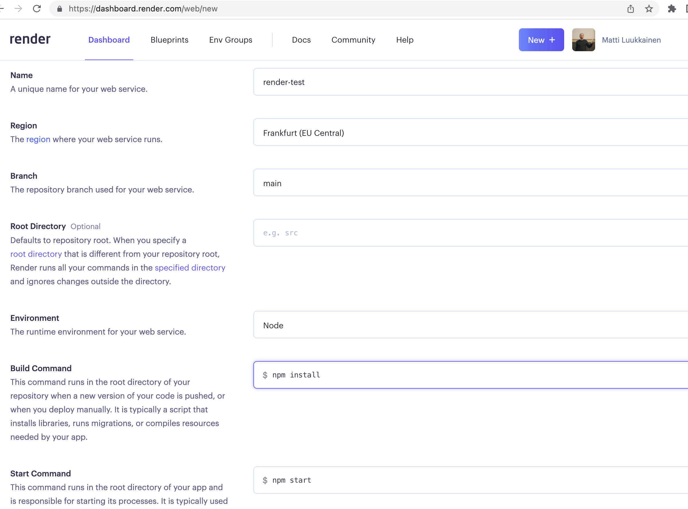
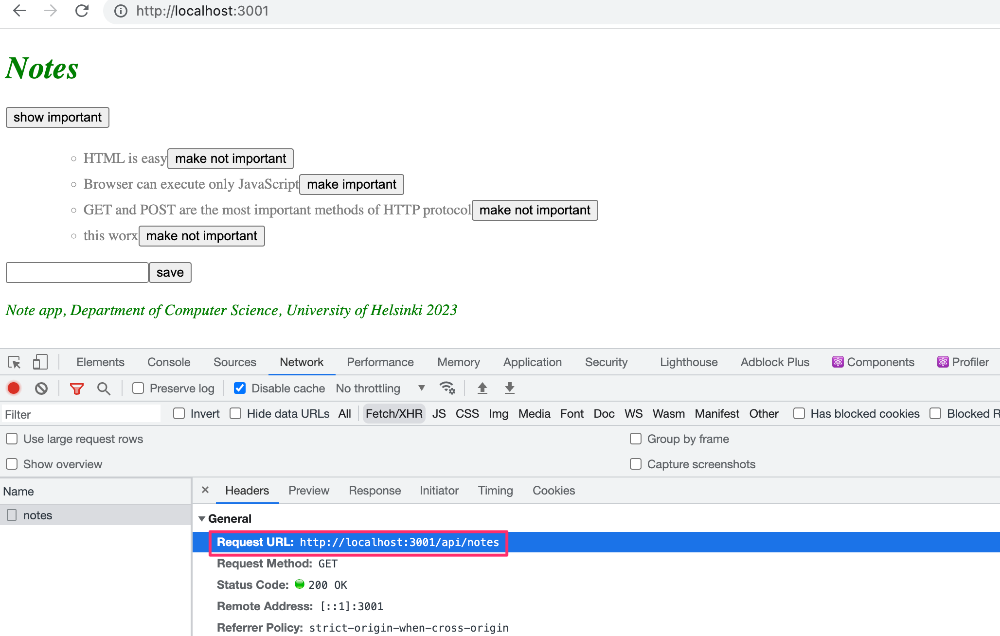
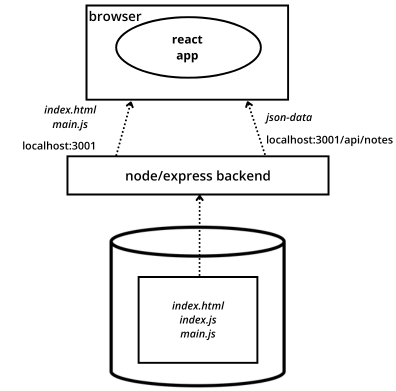
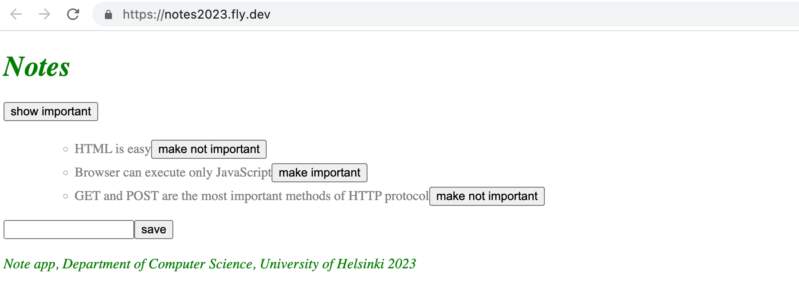
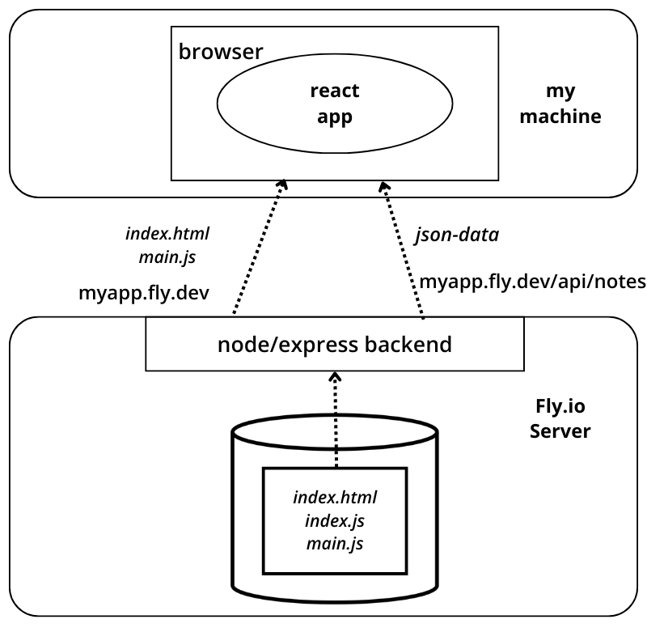
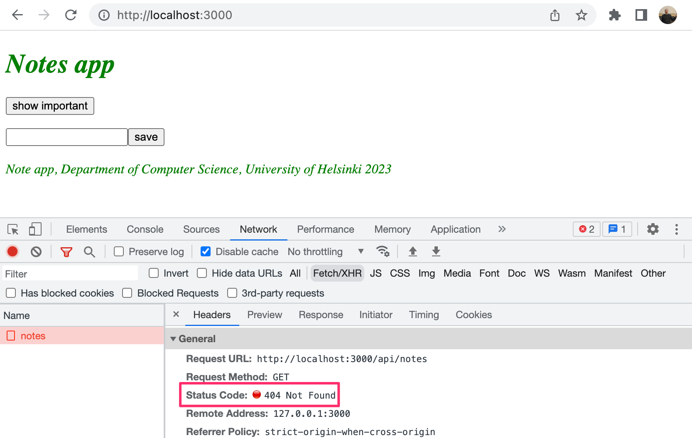

<div class="content">

A continuación, conectemos el frontend que creamos en la [parte 2](/es/part2) a nuestro propio backend.

En la parte anterior, el frontend podía pedir la lista de notas del servidor json que teníamos como backend, desde la dirección http://localhost:3001/notes.
Nuestro backend tiene ahora una estructura de URL ligeramente diferente, ya que las notas se pueden encontrar en <http://localhost:3001/api/notes>. Cambiemos el atributo _baseUrl_ en <i>src/services/notes.js</i> así:

```js
import axios from 'axios'
const baseUrl = 'http://localhost:3001/api/notes' //highlight-line

const getAll = () => {
  const request = axios.get(baseUrl)
  return request.then(response => response.data)
}

// ...

export default { getAll, create, update }
```

Ahora la solicitud GET del frontend a <http://localhost:3001/api/notes> no funciona por alguna razón:


¿Que está pasando aquí? Podemos acceder al backend desde un navegador y desde postman sin ningún problema.

### Política de mismo origen y CORS

El problema radica en algo llamado _same origin policy (política de mismo origen)_. El origen de una URL es definido por la combinación de protocolo (también conocido como esquema), nombre de host y puerto.

```text
http://example.com:80/index.html
  
protocol: http
host: example.com
port: 80
```

Cuando visitas un sitio web (por ejemplo, <http://example.com>), el navegador emite una solicitud al servidor en el que está alojado el sitio web (example.com). La respuesta enviada por el servidor es un archivo HTML que puede contener una o más referencias a recursos externos alojados ya sea en el mismo servidor que example.com o en un sitio web diferente. Cuando el navegador ve referencia(s) a una URL en el HTML fuente, emite una solicitud. Si la solicitud se realiza utilizando la URL desde la cual se obtuvo el HTML fuente, entonces el navegador procesa la respuesta sin problemas. Sin embargo, si el recurso se obtiene utilizando una URL que no comparte el mismo origen (esquema, host, puerto) que el HTML fuente, el navegador tendrá que verificar el encabezado de respuesta _Access-Control-Allow-Origin_. Si contiene _*_ en la URL del HTML fuente, el navegador procesará la respuesta; de lo contrario, el navegador se negará a procesarla y generará un error.

La <strong>política de mismo origen</strong> es un mecanismo de seguridad implementado por los navegadores para prevenir el secuestro de sesiones, entre otras vulnerabilidades de seguridad.

Para habilitar solicitudes cruzadas legítimas (solicitudes a URLs que no comparten el mismo origen), W3C ideó un mecanismo llamado <strong>CORS</strong> (Cross-Origin Resource Sharing). Según [Wikipedia](https://es.wikipedia.org/wiki/Intercambio_de_recursos_de_origen_cruzado):

> <i>El intercambio de recursos de origen cruzado (CORS) es un mecanismo que permite solicitar recursos restringidos (por ejemplo, tipografías) en una página web desde otro dominio fuera del dominio desde el que se sirvió el primer recurso. Una página web puede incrustar libremente imágenes, hojas de estilo, scripts, iframes y videos de origen cruzado. Ciertas solicitudes "entre dominios", en particular las solicitudes Ajax, están prohibidas de forma predeterminada por la política de seguridad del mismo origen.</i>

En nuestro contexto, el problema es que, por defecto, el código JavaScript de una aplicación que se ejecuta en un navegador solo puede comunicarse con un servidor en el mismo [origen](https://developer.mozilla.org/es/docs/Web/Security/Same-origin_policy).
Debido a que nuestro servidor está en el puerto localhost 3001 y nuestra interfaz en el puerto localhost 3000, no tienen el mismo origen.

Ten en cuenta que la [política de mismo origen](https://developer.mozilla.org/es/docs/Web/Security/Same-origin_policy) y CORS no son específicos de React o Node. De hecho, son principios universales del funcionamiento de las aplicaciones web.

Podemos permitir solicitudes de otros <i>orígenes</i> utilizando el middleware [cors](https://github.com/expressjs/cors) de Node.

En tu repositorio backend, Instala <i>cors</i> con el comando

```bash
npm install cors
```

usemos el middleware y así permitimos solicitudes de todos los orígenes:

```js
const cors = require('cors')

app.use(cors())
```

Ahora, ¡la mayoría de las funcionalidades del frontend funcionan! La funcionalidad para cambiar la importancia de las notas aún no se ha implementado en el backend, por lo que naturalmente, esto todavía no funciona en el frontend. Deberemos arreglarlo luego.

Puedes leer más sobre CORS en la [página de Mozilla](https://developer.mozilla.org/es/docs/Web/HTTP/CORS).

La configuración de nuestra aplicación se ve así ahora:


La aplicación React que se ejecuta en el navegador ahora obtiene los datos del servidor node/express que se ejecuta en localhost:3001.

### Aplicación a Internet

Ahora que todo el stack está listo, movamos nuestra aplicación a Internet.

Hay un número cada vez mayor de servicios que se pueden utilizar para alojar una aplicación en Internet. Los servicios orientados al desarrollador, como PaaS (es decir, Plataforma como Servicio), se encargan de instalar el entorno de ejecución (por ejemplo, Node.js) y también pueden proporcionar varios servicios, como bases de datos.

Durante una década, [Heroku](http://heroku.com) dominó la escena de PaaS. Desafortunadamente, el nivel gratuito de Heroku terminó el 27 de noviembre de 2022. Esto es muy desafortunado para muchos desarrolladores, especialmente estudiantes. Heroku sigue siendo una opción viable si estás dispuesto a gastar algo de dinero. También tienen [un programa para estudiantes](https://www.heroku.com/students) que proporciona algunos créditos gratuitos.

Ahora estamos presentando dos servicios [Fly.io](https://fly.io/) y [Render](https://render.com/) que ambos tienen un plan gratuito (limitado). Fly.io es nuestro servicio de alojamiento "oficial", ya que se puede utilizar con seguridad también en las partes 11 y 13 del curso. Render también funcionará bien al menos para las otras partes de este curso.

Ten en cuenta que a pesar de utilizar solo el nivel gratuito, Fly.io <i>puede</i> requerir que ingreses los detalles de tu tarjeta de crédito. En este momento, Render se puede usar sin una tarjeta de crédito.

Render podría ser un poco más fácil de usar, ya que no requiere que se instale ningún software en tu máquina.

También hay algunas otras opciones de alojamiento gratuitas que funcionan bien para este curso, al menos para todas las partes excepto la parte 11 (CI/CD), la cual podría tener un ejercicio complicado para otras plataformas.

Algunos participantes del curso también han utilizado los siguientes servicios:

- [Cyclic](https://www.cyclic.sh/)
- [Replit](https://replit.com)
- [CodeSandBox](https://codesandbox.io)

Si conoces otros servicios buenos y fáciles de usar para alojar NodeJS, ¡háznoslo saber!

Para Fly.io y Render, necesitamos cambiar la definición del puerto que nuestra aplicación utiliza al final del archivo <i>index.js</i> en el backend de la siguiente manera:

```js
const PORT = process.env.PORT || 3001  // highlight-line
app.listen(PORT, () => {
  console.log(`Server running on port ${PORT}`)
})
```

Ahora estamos utilizando el puerto definido en la [variable de entorno](https://es.wikipedia.org/wiki/Variable_de_entorno) _PORT_ o el puerto 3001 si la variable de entorno _PORT_ no está definida. Fly.io y Render configuran el puerto de la aplicación en función de esa variable de entorno.

#### Fly.io

<i>Ten en cuenta que es posible que necesites proporcionar el número de tu tarjeta de crédito a Fly.io incluso si estás utilizando solo el nivel gratuito.</i> De hecho, ha habido informes contradictorios al respecto, se sabe con certeza que algunos de los estudiantes en este curso están utilizando Fly.io sin ingresar la información de su tarjeta de crédito. En este momento, [Render](https://render.com/) se puede utilizar sin una tarjeta de crédito.

Por defecto, todos obtienen dos máquinas virtuales gratuitas que se pueden utilizar para ejecutar dos aplicaciones al mismo tiempo.

Si decides utilizar [Fly.io](https://fly.io/), comienza instalando su ejecutable flyctl siguiendo [esta guía](https://fly.io/docs/hands-on/install-flyctl/). Después de eso, debes [crear una cuenta en Fly.io](https://fly.io/docs/hands-on/sign-up/).

Comienza [autenticándote](https://fly.io/docs/hands-on/sign-in/) a través de la línea de comandos con el siguiente comando:

```bash
fly auth login
```

Ten en cuenta que si el comando _fly_ no funciona en tu máquina, puedes probar la versión más larga _flyctl_. Por ejemplo, en MacOS, ambas formas del comando funcionan.

<i>Si no logras que flyctl funcione en tu máquina, puedes probar Render (ver la próxima sección), no requiere que se instale nada en tu máquina.</i>

La inicialización de una aplicación se realiza ejecutando el siguiente comando en el directorio raíz de la aplicación:

```bash
fly launch
```

Dale un nombre a la aplicación o permite que Fly.io genere uno automáticamente. Selecciona una región donde se ejecutará la aplicación. No crees una base de datos PostgreSQL para la aplicación y no crees una base de datos Upstash Redis, ya que no son necesarias.

La última pregunta es "Would you like to deploy now? (¿Quieres desplegar ahora?)". Deberíamos responder "no" ya que aún no estamos listos.

Fly.io crea un archivo <i>fly.toml</i> en la raíz de tu aplicación donde podemos configurarlo. Para poner en marcha la aplicación, <i>podríamos</i> necesitar hacer una pequeña adición a la configuración:

```bash
[build]

[env]
  PORT = "3000" # add this

[http_service]
  internal_port = 3000 # ensure that this is same as PORT
  force_https = true
  auto_stop_machines = true
  auto_start_machines = true
  min_machines_running = 0
  processes = ["app"]
```

Hemos definido ahora en la sección [env] que la variable de entorno PORT obtendrá el puerto correcto (definido en la sección [http_service]) donde la aplicación debe crear el servidor.

Ahora estamos listos para implementar la aplicación en los servidores de Fly.io. Esto se hace con el siguiente comando:

```bash
fly deploy
```

Si todo va bien, la aplicación debería estar ahora activa y funcionando. Puedes abrirla en el navegador con el siguiente comando

```bash
fly apps open
```

Un comando especialmente importante es _fly logs_. Este comando se puede utilizar para ver los registros del servidor. Es mejor mantener siempre visibles los registros.

**Nota:** Fly podría crear 2 máquinas para tu aplicación. Si esto sucede, el estado de los datos en tu aplicación será inconsistente entre las solicitudes. Es decir, tendrías dos máquinas, cada una con su propia variable de notas. Podrías realizar un POST en una máquina y luego tu siguiente GET podría ir a otra máquina. Puedes verificar el número de máquinas usando el comando "$ fly scale show". Si el recuento es mayor que 1, puedes forzar que sea 1 con el comando "$ fly scale count 1". El recuento de máquinas también se puede verificar en el panel de control.

**Nota:** En algunos casos (la causa aún se desconoce), ejecutar comandos de Fly.io, especialmente en Windows WSL (Subsistema de Windows para Linux), ha causado problemas. Si el siguiente comando se cuelga

```bash
flyctl ping -o personal
```

tu computadora no puede conectarse por alguna razón a Fly.io. Si esto te sucede, [este enlace](https://github.com/fullstack-hy2020/misc/blob/master/fly_io_problem.md) describe una posible manera de proceder.

Si la salida del siguiente comando se ve así:

```bash
$ flyctl ping -o personal
35 bytes from fdaa:0:8a3d::3 (gateway), seq=0 time=65.1ms
35 bytes from fdaa:0:8a3d::3 (gateway), seq=1 time=28.5ms
35 bytes from fdaa:0:8a3d::3 (gateway), seq=2 time=29.3ms
...
```

¡entonces no hay problemas de conexión!

Cada vez que realices cambios en la aplicación, puedes llevar la nueva versión a producción con el siguiente comando:

```bash
fly deploy
```

#### Render

Lo siguiente asume que ya has iniciado sesión [aquí](https://dashboard.render.com/) con una cuenta de GitHub.

Después de iniciar sesión, creemos un nuevo "web service":


Luego, el repositorio de la aplicación se conecta a Render:


La conexión parece requerir que el repositorio de la aplicación sea público.

A continuación, definiremos las configuraciones básicas. Si la aplicación <i>no</i> está en la raíz del repositorio, se debe proporcionar un valor adecuado para el <i>Root directory</i>:



Después de esto, la aplicación se inicia en Render. El panel nos muestra el estado de la aplicación y la URL donde se está ejecutando:


Según la [documentación](https://render.com/docs/deploys), cada commit en GitHub debería volver a desplegar la aplicación. Por alguna razón, esto no siempre funciona.

Afortunadamente, también es posible volver a desplegar manualmente la aplicación:


Además, los registros de la aplicación se pueden ver en el panel:


Observamos ahora desde los registros que la aplicación se ha iniciado en el puerto 10000. El código de la aplicación obtiene el puerto correcto a través de la variable de entorno PORT, por lo que es esencial que el archivo <i>index.js</i> se haya actualizado en el backend de la siguiente manera:

```js
const PORT = process.env.PORT || 3001  // highlight-line
app.listen(PORT, () => {
  console.log(`Server running on port ${PORT}`)
})
```

### Frontend production build

Hasta ahora hemos estado ejecutando el código de React en <i>modo de desarrollo</i>. En el modo de desarrollo, la aplicación está configurada para dar mensajes de error claros, mostrar inmediatamente los cambios de código en el navegador, etc.

Cuando se despliega la aplicación, debemos crear un [production build](https://es.vitejs.dev/guide/build) (compilación de producción) o una versión de la aplicación que esté optimizada para producción.

Una compilación de producción para aplicaciones creadas con Vite puede crearse con el comando [npm run build](https://es.vitejs.dev/guide/build).

Ejecutemos este comando desde la <i>raíz del proyecto frontend</i> que desarrollamos en la [Parte 2](/es/part2).

Esto crea un directorio llamado <i>dist</i> (que contiene el único archivo HTML de nuestra aplicación, <i>index.html</i>) y el directorio <i>assets</i>. Se generará una versión [Minified](<https://en.wikipedia.org/wiki/Minification_(programming)>)(reducida) del código JavaScript de nuestra aplicación en el directorio <i>dist</i>. Aunque el código de la aplicación está en varios archivos, todo el JavaScript se reducirá en un solo archivo. En realidad, todo el código de todas las dependencias de la aplicación también se reducirá en este único archivo.

El código reducido no es muy legible. El comienzo del código se ve así:

```js
!function(e){function r(r){for(var n,f,i=r[0],l=r[1],a=r[2],c=0,s=[];c<i.length;c++)f=i[c],o[f]&&s.push(o[f][0]),o[f]=0;for(n in l)Object.prototype.hasOwnProperty.call(l,n)&&(e[n]=l[n]);for(p&&p(r);s.length;)s.shift()();return u.push.apply(u,a||[]),t()}function t(){for(var e,r=0;r<u.length;r++){for(var t=u[r],n=!0,i=1;i<t.length;i++){var l=t[i];0!==o[l]&&(n=!1)}n&&(u.splice(r--,1),e=f(f.s=t[0]))}return e}var n={},o={2:0},u=[];function f(r){if(n[r])return n[r].exports;var t=n[r]={i:r,l:!1,exports:{}};return e[r].call(t.exports,t,t.exports,f),t.l=!0,t.exports}f.m=e,f.c=n,f.d=function(e,r,t){f.o(e,r)||Object.defineProperty(e,r,{enumerable:!0,get:t})},f.r=function(e){"undefined"!==typeof Symbol&&Symbol.toStringTag&&Object.defineProperty(e,Symbol.toStringTag,{value:"Module"})
```

### Sirviendo archivos estáticos desde el backend

Una opción para implementar el frontend es copiar la compilación de producción (el directorio <i>dist</i>) a la raíz del repositorio del backend y configurar el backend para que muestre la <i>página principal</i> del frontend (el archivo <i>dist/index.html</i>) como su página principal.

Comenzamos copiando la compilación de producción del frontend a la raíz del backend. Con una computadora Mac o Linux, la copia se puede hacer desde el directorio frontend con el comando

```bash
cp -r dist ../backend
```

Si estás usando una computadora con Windows, puedes usar el comando [copy](https://www.windows-commandline.com/windows-copy-command-syntax-examples/) o [xcopy](https://www.windows-commandline.com/xcopy-command-syntax-examples/) en su lugar. De lo contrario, simplemente copia y pega.

El directorio de backend ahora debería verse así:


Para hacer que Express muestre <i>contenido estático</i>, la página <i>index.html</i>  y el JavaScript, etc., necesitamos un middleware integrado de Express llamado [static](http://expressjs.com/en/starter/static-files.html).

Cuando agregamos lo siguiente en medio de las declaraciones de middlewares

```js
app.use(express.static('dist'))
```

siempre que Express recibe una solicitud HTTP GET, primero verificará si el directorio <i>dist</i> contiene un archivo correspondiente a la dirección de la solicitud. Si se encuentra un archivo correcto, Express lo devolverá.

Ahora las solicitudes HTTP GET a la dirección <i>www.serversaddress.com/index.html</i> o <i>www.serversaddress.com</i> mostrarán el frontend de React. Las solicitudes GET a la dirección <i>www.serversaddress.com/api/notes</i> serán manejadas por el código del backend.

Debido a nuestra situación, tanto el frontend como el backend están en la misma dirección, podemos declarar _baseUrl_ como una URL [relativa](https://www.w3.org/TR/WD-html40-970917/htmlweb.html#h-5.1.2). Esto significa que podemos omitir la parte que declara el servidor.

```js
import axios from 'axios'
const baseUrl = '/api/notes' // highlight-line

const getAll = () => {
  const request = axios.get(baseUrl)
  return request.then(response => response.data)
}

// ...
```

Después del cambio, tenemos que crear una nueva compilación de producción y copiarla en la raíz del repositorio de backend.

La aplicación ahora se puede utilizar desde la dirección de <i>backend</i> <http://localhost:3001>:


Nuestra aplicación ahora funciona exactamente como la aplicación de ejemplo de [una sola pagina](/es/part0/fundamentos_de_las_aplicaciones_web#aplicacion-de-una-sola-pagina) que estudiamos en la parte 0.

Cuando usamos un navegador para ir a la dirección <http://localhost:3001>, el servidor devuelve el archivo <i>index.html</i> del directorio <i>dist</i>. El contenido del archivo es el siguiente:

```html
<!doctype html>
<html lang="en">
  <head>
    <meta charset="UTF-8" />
    <link rel="icon" type="image/svg+xml" href="/vite.svg" />
    <meta name="viewport" content="width=device-width, initial-scale=1.0" />
    <title>Vite + React</title>
    <script type="module" crossorigin src="/assets/index-5f6faa37.js"></script>
    <link rel="stylesheet" href="/assets/index-198af077.css">
  </head>
  <body>
    <div id="root"></div>
    
  </body>
</html>

```

El archivo contiene instrucciones para obtener una hoja de estilo CSS que define los estilos de la aplicación y una etiqueta <i>script</i> que indica al navegador que obtenga el código JavaScript de la aplicación, es decir, la aplicación React.

El código de React obtiene notas de la dirección del servidor <http://localhost:3001/api/notes> y las muestra en la pantalla. Las comunicaciones entre el servidor y el navegador se pueden ver en la pestaña <i>Network</i> de la consola del desarrollador:



La configuración que está lista para un despliegue en producción se ve así:



A diferencia de cuando se ejecuta la aplicación en un entorno de desarrollo, todo está ahora en el mismo backend de node/express que se ejecuta en localhost:3001. Cuando el navegador accede a la página, se renderiza el archivo <i>index.html</i>. Esto hace que el navegador obtenga la versión de producción de la aplicación React. Una vez que comienza a ejecutarse, obtiene los datos en formato JSON desde la dirección localhost:3001/api/notes.

### La aplicación completa en Internet

Después de asegurarte de que la versión de producción de la aplicación funcione localmente, haz un commit de la compilación de producción del frontend en el repositorio de backend y envía el código a GitHub nuevamente.

**NB:** Si usas Render, asegúrate de que el directorio <i>dist</i> no esté ignorado por Git en el backend.

Si estás utilizando Render, un envío a GitHub <i>podría</i> ser suficiente. Si el despliegue automático no funciona, selecciona "manual deploy (despliegue manual)" desde el panel de Render.

En el caso de Fly.io, el nuevo despliegue se realiza con el comando

```bash
fly deploy
```

La aplicación funciona perfectamente, excepto que aún no hemos agregado la funcionalidad para cambiar la importancia de una nota en el backend.

<strong>NOTA:</strong> Al usar Fly.io, ten en cuenta que el archivo _.dockerignore_ en tu directorio de proyecto enumera los archivos que no se suben durante el despliegue. El directorio dist se incluye por defecto. Para desplegar este directorio, elimina su referencia del archivo .dockerignore, asegurando que tu aplicación se despliegue correctamente.



<i>**NOTA:** el cambio de la importancia TODAVÍA NO funciona ya que el backend aún no lo tiene implementado.</i>

Nuestra aplicación guarda las notas en una variable. Si la aplicación se bloquea o se reinicia, todos los datos desaparecerán.

La aplicación necesita una base de datos. Antes de introducir una, repasemos algunas cosas.

La configuración ahora se ve así:



El backend de node/express ahora reside en el servidor de Fly.io/Render. Cuando se accede a la dirección raíz, el navegador carga y ejecuta la aplicación React que obtiene los datos JSON del servidor de Fly.io/Render.

### Optimizando el despliegue del frontend

Para crear una nueva compilación de producción del frontend sin trabajo manual adicional, agreguemos algunos scripts npm al <i>package.json</i> del repositorio de backend.

#### Fly.io script

Los scripts se ven así:

```json
{
  "scripts": {
    // ...
    "build:ui": "rm -rf dist && cd ../notes-frontend/ && npm run build && cp -r dist ../notes-backend",
    "deploy": "fly deploy",
    "deploy:full": "npm run build:ui && npm run deploy",    
    "logs:prod": "fly logs"
  }
}
```

##### Para usuarios de Windows

Ten en cuenta que los comandos de shell estándar en `build:ui` no funcionan de forma nativa en Windows. En Powershell de Windows se puede escribir el script como

```json
"build:ui": "@powershell Remove-Item -Recurse -Force dist && cd ../frontend && npm run build && @powershell Copy-Item dist -Recurse ../backend",
```
 
Si el script no funciona en Windows, confirma que estás utilizando Powershell y no el Command Prompt. Si has instalado Git Bash u otro terminal similar a Linux, es posible que puedas ejecutar comandos similares a Linux también en Windows.

El script _npm run build:ui_ construye el frontend y copia la versión de producción bajo el repositorio del backend. El script _npm run deploy_ despliega el backend actual en Fly.io.

_npm run deploy:full_ combina estos dos scripts, es decir, _npm run build:ui_ y _npm run deploy_.

También hay un script _npm run logs:prod_ para mostrar los logs de Fly.io.

Ten en cuenta que las rutas de directorio en el script <i>build:ui</i> dependen de la ubicación de los repositorios en el sistema de archivos.

#### Render

Nota: Cuando intentes desplegar tu backend en Render, asegúrate de tener un repositorio separado para el backend y despliega ese repositorio de GitHub a través de Render. Intentar desplegar a través de tu repositorio Fullstackopen a menudo arrojará "ERR path ....package.json".

En el caso de Render, los scripts se ven así:

```json
{
  "scripts": {
    //...
    "build:ui": "rm -rf dist && cd ../frontend && npm run build && cp -r dist ../backend",
    "deploy:full": "npm run build:ui && git add . && git commit -m uibuild && git push"
  }
}
```

El script _npm run build:ui_ construye el frontend y copia la versión de producción en el repositorio del backend. _npm run deploy:full_ también contiene los comandos <i>git</i> necesarios para actualizar el repositorio del backend.

Ten en cuenta que las rutas de directorio en el script <i>build:ui</i> dependen de la ubicación de los repositorios en el sistema de archivos.

>**NB**  En Windows, los scripts de npm se ejecutan en cmd.exe como la shell predeterminada, que no admite comandos bash. Para que funcionen los comandos bash anteriores, puedes cambiar la shell predeterminada a Bash (en la instalación estándar de Git para Windows) de la siguiente manera:

```md
npm config set script-shell "C:\\Program Files\\git\\bin\\bash.exe"
```

Otra opción es el uso de [shx](https://www.npmjs.com/package/shx).

### Proxy

Los cambios en el frontend han hecho que ya no funcione en el modo de desarrollo (cuando se inicia con el comando _npm run dev), ya que la conexión con el backend no funciona.



Esto se debe al cambio de la dirección de backend a una URL relativa:

```js
const baseUrl = '/api/notes'
```

Debido a que en el modo de desarrollo el frontend está en la dirección <i>localhost:5173</i>, las solicitudes al backend van a la dirección incorrecta <i>localhost:5173/api/notes</i>. El backend está en <i>localhost:3001</i>.

Si el proyecto se creó con Vite, este problema es fácil de resolver. Es suficiente agregar la siguiente declaración al archivo <i>vite.config.js</i> del repositorio de frontend.

```bash
import { defineConfig } from 'vite'
import react from '@vitejs/plugin-react'

// https://vitejs.dev/config/
export default defineConfig({
  plugins: [react()],
  // highlight-start
  server: {
    proxy: {
      '/api': {
        target: 'http://localhost:3001',
        changeOrigin: true,
      },
    }
  },
  // highlight-end
})

```

Después de reiniciar, el entorno de desarrollo de React funcionará como un [proxy](https://es.vitejs.dev/config/server-options#server-proxy). Si el código de React realiza una solicitud HTTP a una dirección de servidor en <i>http://localhost:5173</i> no administrada por la aplicación React en sí (es decir, cuando las solicitudes no tratan de obtener el CSS o JavaScript de la aplicación), la solicitud se redirigirá a el servidor en <i>http://localhost:3001</i>.

Ten en cuenta que con la configuración de Vite mostrada anteriormente, solo las solicitudes realizadas a rutas que comienzan con <i>/api</i> se redirigen al servidor.

Ahora el frontend funciona bien, trabajando con el servidor tanto en el modo de desarrollo como en el de producción.

Un aspecto negativo de nuestro enfoque es lo complicado que resulta implementar el frontend. Desplegar una nueva versión requiere generar una nueva compilación de producción del frontend y copiarla al repositorio del backend. Esto dificulta la creación de un [pipeline de despliegue](https://martinfowler.com/bliki/DeploymentPipeline.html) automatizado. Un pipeline de despliegue es una forma automatizada y controlada de mover el código desde la computadora del desarrollador a través de diferentes pruebas y controles de calidad hasta el entorno de producción. La construcción de un pipeline de despliegue es el tema de la [parte 11](/en/part11) de este curso. Hay varias formas de lograr esto, por ejemplo, colocar tanto el código del backend como del frontend en el mismo repositorio, pero no profundizaremos en eso por ahora.

En algunas situaciones, puede tener sentido implementar el código del frontend como su propia aplicación.

El código actual del backend se puede encontrar en [Github](https://github.com/fullstack-hy2020/part3-notes-backend/tree/part3-3), en la rama <i>part3-3</i>. Los cambios en el código del frontend están en la rama <i>part3-1</i> del [repositorio del frontend](https://github.com/fullstack-hy2020/part2-notes-frontend/tree/part3-1).

</div>

<div class="tasks">

### Ejercicios 3.9.-3.11.

Los siguientes ejercicios no requieren muchas líneas de código. Sin embargo, pueden ser un desafío, porque debes comprender exactamente qué está sucediendo y dónde, y las configuraciones deben ser las correctas.

#### 3.9 Backend de la Agenda Telefónica, paso 9

Haz que el backend funcione con el frontend de la agenda telefónica de los ejercicios de la parte anterior. No implementes todavía la funcionalidad para realizar cambios en los números de teléfono, que se implementará en el ejercicio 3.17.

Probablemente tendrás que hacer algunos pequeños cambios en el frontend, al menos en las URL del backend. Recuerda mantener abierta la consola del desarrollador en tu navegador. Si algunas solicitudes HTTP fallan, debes verificar en la pestaña <i>Network</i> qué está sucediendo. Vigila también la consola del backend. Si no hiciste el ejercicio anterior, vale la pena imprimir los datos de la solicitud o <i>request.body</i> en la consola en el controlador de eventos responsable de las solicitudes POST.

#### 3.10 Backend de la Agenda Telefónica, paso 10

Despliega el backend en Internet, por ejemplo en Fly.io o Render.

Prueba el backend desplegado con un navegador y el REST client de VS Code o con Postman para asegurarte de que funcione.

**PRO TIP:** Cuando despliegues tu aplicación en Internet, vale la pena al menos al principio estar atento a los logs de la aplicación **EN TODO MOMENTO**.

Crea un README.md en la raíz de tu repositorio y agrega un enlace a tu aplicación en línea.

**NOTA**: como se mencionó, debes desplegar el BACKEND al servicio en la nube. Si estás utilizando Fly.io, los comandos deben ejecutarse en el directorio raíz del backend (es decir, en el mismo directorio donde se encuentra el package.json del backend). En caso de usar Render, el backend debe estar en la raíz de tu repositorio.

NO deberás desplegar el frontend directamente en ninguna etapa de esta parte. Solo se desplegara el repositorio del backend en todo este proceso, nada más.

#### 3.11 Agenda Telefónica Full Stack

Genera un build de producción de tu frontend y agrégalo a la aplicación en Internet utilizando el método introducido en esta parte.

**NB:** Si usas Render, asegúrate de que el directorio <i>dist</i> no esté ignorado por Git en el backend.

También, asegúrate de que el frontend aún funcione localmente (en modo de desarrollo cuando se inicia con el comando _npm run dev_).

Si encuentras problemas para que la aplicación funcione, asegúrate de que tu estructura de directorios coincida con [la aplicación de ejemplo](https://github.com/fullstack-hy2020/part3-notes-backend/tree/part3-3).

</div>
